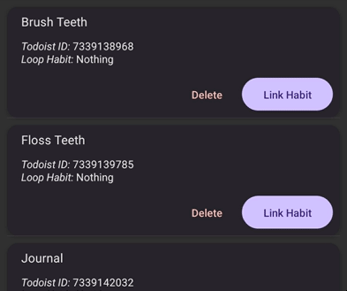

<div align="center">

# Todoist -> Loop Habit Tracker


Keeping track of your habits has never been easier

[](https://github.com/thehale/docker-python-poetry/blob/master/LICENSE)
[](https://github.com/sponsors/thehale)
[](https://jhale.dev)
[](https://www.linkedin.com/comm/mynetwork/discovery-see-all?usecase=PEOPLE_FOLLOWS&followMember=thehale)

</div>


[Todoist](https://todoist.com/) is an excellent task tracking app, but has poor
habit tracking capabilities. [Loop Habit
Tracker](https://play.google.com/store/apps/details?id=org.isoron.uhabits) is an
excellent habit tracking app, but has no task tracking capabilities.

Enter **Todoist Habit Sync** which automatically marks off habits in Loop
Habit Tracker when you complete a recurring task in Todoist. Now you have the
best of both worlds!

Here's how:

1. Open the app
2. Link your Todoist tasks to Loop Habits
3. Done! 🎉

<div align="center">



</div>


## FAQ

### Why are some of my Todoist tasks not listed?

Todoist Habit Sync only works with completed [recurring
tasks](https://todoist.com/help/articles/set-a-recurring-due-date). Get a solid
start on your new habit by completing the task at least once for it to show up.

### Why are my habits not being marked automatically?

Make sure your API key has been entered correctly. Without valid credentials,
this app cannot get the necessary data from Todoist to mark off your habits.

Next, try a manual habit sync using the button at the bottom of the main screen.
If that works, you most likely need to open your phone's battery settings and
allow Todoist Habit Sync to [run in the background without
restrictions](https://www.droidviews.com/turn-off-battery-optimization-for-individual-android-apps/).

If the manual habit sync didn't work, also check the following:
 1. Have you completed the task in Todoist since midnight today?
 2. Is the task linked to the habit correctly? Consider unlinking and trying
    again.

If things still aren't working, [create an
issue](https://github.com/thehale/TodoistHabitSync/issues/new/choose) to report
the problem.

### How is my data accessed/used/protected?

After opening the app for the first time, you will be prompted to enter a
[Todoist API Token](https://todoist.com/help/articles/find-your-api-token) so
that Todoist Habit Sync can pull data about your completed tasks without needing
your Todoist username or password. The token never leaves your device except for
communicating with Todoist's servers over a secure connection.

Your tasks are similarly protected. Todoist Habit Sync only downloads data about
the tasks completed in the last 24 hours and only saves a [few key fields about
the task](./src/lib/Todoist.ts) (e.g. title, Todoist ID, and precise completion
time). All other task data like descriptions, assignees, comments, and
attachments are discarded immediately. Tasks linked to a habit are stored on the
device until you delete them.

Your habits are fully controlled by Loop Habit Tracker which only shares the
habit name with Todoist Habit Sync. Habit data never leaves your device.

You can read my privacy policy to learn more about [my philosophy on apps and
data usage](https://jhale.dev/privacy-policy.html).


## License

Copyright (c) 2023 - Joseph Hale. All Rights Reserved.

```
Todoist Habit Sync by Joseph Hale is licensed under the terms of the Mozilla
Public License, v 2.0, which are available at https://mozilla.org/MPL/2.0/.

You can download the source code for Todoist Habit Sync for free from
https://github.com/thehale/TodoistHabitSync.
```
<details>

<summary><b>What does the MPL-2.0 license allow/require?</b></summary>

### TL;DR

You can use files from this project in both open source and proprietary
applications, provided you include the above attribution. However, if
you modify any code in this project, or copy blocks of it into your own
code, you must publicly share the resulting files (note, not your whole
program) under the MPL-2.0. The best way to do this is via a Pull
Request back into this project.

If you have any other questions, you may also find Mozilla's [official
FAQ](https://www.mozilla.org/en-US/MPL/2.0/FAQ/) for the MPL-2.0 license
insightful.

If you dislike this license, you can contact me about negotiating a paid
contract with different terms.

**Disclaimer:** This TL;DR is just a summary. All legal questions
regarding usage of this project must be handled according to the
official terms specified in the `LICENSE` file.

### Why the MPL-2.0 license?

I believe that an open-source software license should ensure that code
can be used everywhere.

Strict copyleft licenses, like the GPL family of licenses, fail to
fulfill that vision because they only permit code to be used in other
GPL-licensed projects. Permissive licenses, like the MIT and Apache
licenses, allow code to be used everywhere but fail to prevent
proprietary or GPL-licensed projects from limiting access to any
improvements they make.

In contrast, the MPL-2.0 license allows code to be used in any software
project, while ensuring that any improvements remain available for
everyone.

</details>
